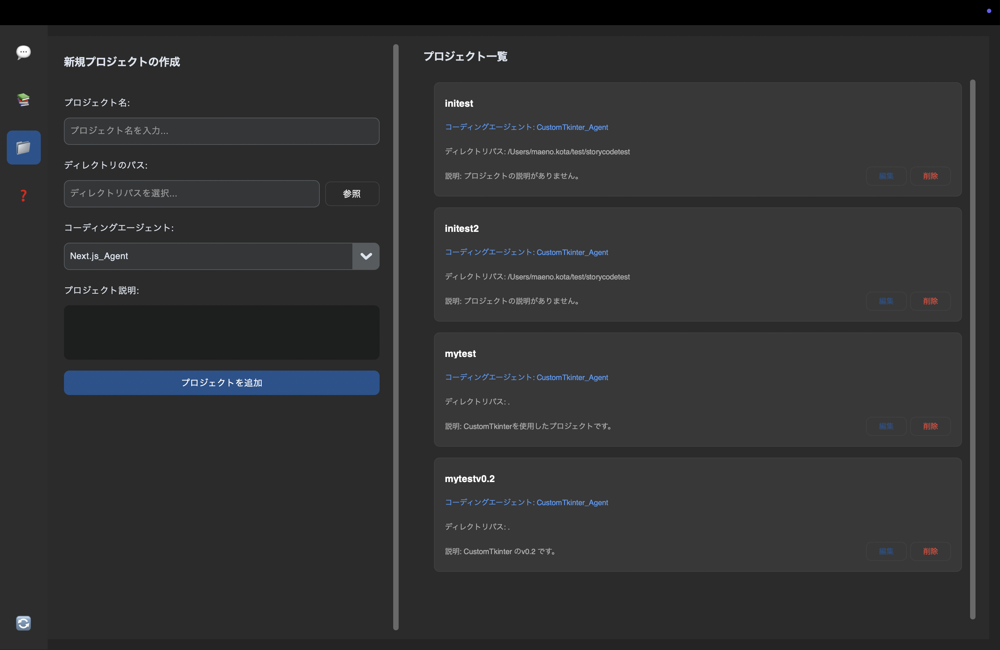
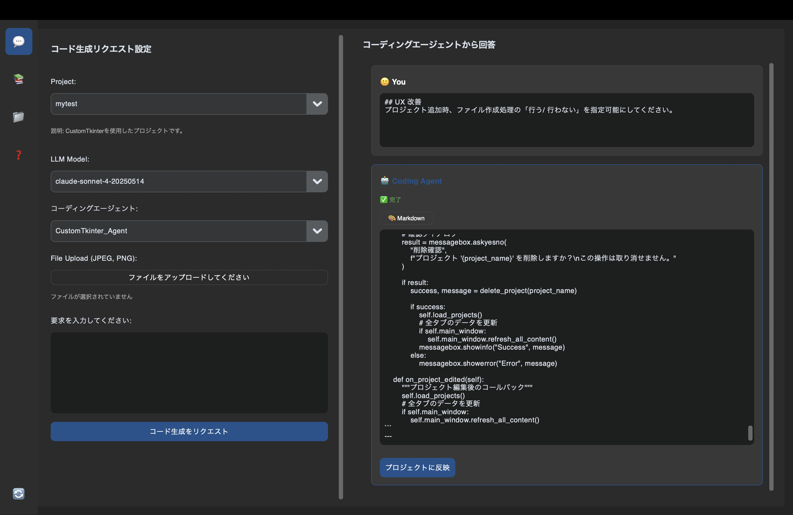
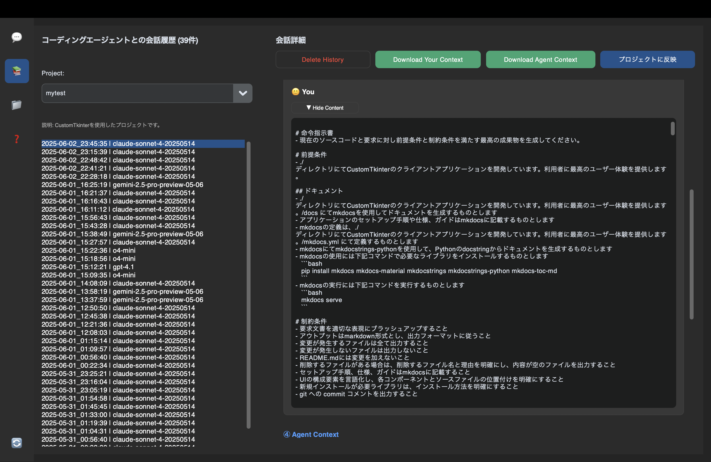
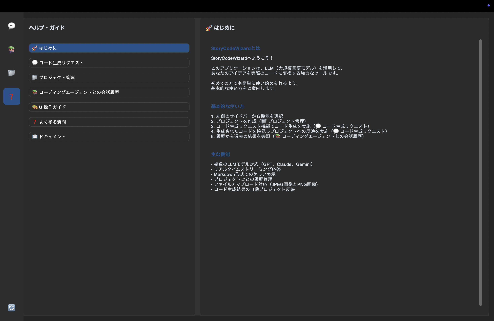

# StoryCodeWizardNext

StoryCodeWizardNextは、自然言語で要件を記述するだけで、アプリ一式を生成しローカル環境に即反映する**Vibe Coding 支援ツール**です。

## 📌 What is StoryCodeWizardNext?
>[(MIT Technology Review)バイブコーディングとは何か？ AIに「委ねる」プログラミング新手法](https://www.technologyreview.jp/s/359884/what-is-vibe-coding-exactly/)<br>
>バイブス（感覚）に完全に身を委ね、指数関数的な進化を受け入れ、コードの存在そのものを忘れてしまいます

StoryCodeWizardNextを使った **「OODAループ×Vibe Coding」** は、
- StoryCodeWizardNextで直感を即座に実行可能に（OODA全フェーズの加速）
- GitHub Copilotで高速にバグを修正し（Actフェーズの迅速化）
- Gitでコミット単位に変更管理を徹底（迅速なロールバックと反復を支援）

これらが統合されることで、指数関数的な改善速度・適応力を備えた新しい開発スタイルを実現します。

## 📌 特徴
1. **プロジェクト起点でのVibeCoding**:<br>
   - プロジェクト（作業ディレクトリとコーディングエージェント）の管理が可能
   - Next.JS, FastAPIに対応
   - プロジェクト毎に履歴を管理し、過去に生成したコードやプロンプトをいつでも参照履歴からダウンロード可能
1. **自然言語によるコード生成(Vibe Coding支援)**:<br>
   - プロジェクトを指定し自然言語で要件を記述することでコード一式が生成可能
   - 作業ディレクトリのコード一式をLLMに与えており、最新のコードを考慮した出力が可能
   - commitコメントも出力可能
1. **作業ディレクトリへのコード反映**:<br>
   - 生成したコードをボタン１つでプロジェクトの作業ディレクトリに反映可能（gitを活用することで想定通りでなければすぐに元に戻せます）
1. **選択可能なLLM（大規模言語モデル）**:
   - メジャーな下記３つのLLMが利用可能
      - OpenAI GPTシリーズ
      - Claude (Anthropic) ★おすすめ
      - Gemini

## 📌 なぜ StoryCodeWizardNext？
|🧩 従来の課題|🔧 StoryCodeWizardNext の解決策|
|-|-|
|コピペ地獄|ソースコードを自動でLLMにインプット。<br>生成されたコードも自動でファイルに保存され、即反映可能|
|クラウド依存 & 制約|ツールはローカルで動作<br>ソースコード一式が柔軟に管理可能|
|ブラックボックス|プロンプト → コードへの変換はすべて可視化される|
|高コスト|1アプリあたり数ドルでの開発が現実的に可能|

## 📌 OODAループ × Vibe Coding
StoryCodeWizardNextは、Vibe Codingを実践的に支援するツールであり、<br>
さらに、OODAループを高速かつ効率よく回すための基盤となります。

|フェーズ|Vibe Coding視点|StoryCodeWizardNextが支援すること|
|-|-|-|
|Observe（観察）|ユーザーの感覚・違和感に気づく|プロンプトによる要件入力で課題を言語化|
|Orient（状況判断）|直感で仮説を立てる|自然言語をコードに即座に変換（生成）|
|Decide（意思決定）|「とりあえず動かす」方向へ|変換されたコードをボタン１つで反映。判断を加速|
|Act（実行）|手を動かして検証|ローカル環境で動作確認後、Dockerコンテナを活用して即時デプロイ|

→ このサイクルを数分で回すことが可能になります。

### 重要な追加観点:
- 🛠 GitHub Copilot：バグ対応を迅速化（Actフェーズを支援）
- 🔄 Git：1サイクル毎にコミット（変更の容易な差し戻しが可能。安心してコード反映が可能）

## 🛠 GitHub CopilotがOODAループを加速する理由

GitHub CopilotはAIによるコード補完・バグ修正支援ツールで、特に **「Act」フェーズ** を飛躍的に高速化します。

|項目|具体的な活用方法|効果|
|-|-|-|
|🐞 バグの迅速検知|エディタ内で即座にバグを指摘・修正候補を提案|問題箇所を即座に発見可能|
|🚀 修正の高速化|Copilotの提案を受け入れるだけで素早く修正完了|開発者の負荷を軽減し、反復を促進|
|🎯 仮説検証の効率化|バグの修正を迅速化することで、検証の高速反復を支援|反復速度向上で学習サイクルが短縮|

### 実際のサイクル例：
   1.	StoryCodeWizardNextでコードを生成
   1.	VS Codeで即時実行、バグ発見
   1.	Copilotを活用してエディタ内でバグ修正
   1.	即時再検証（1へ戻る）

この迅速なバグ対応ループにより、改善サイクルをさらに短縮します。

## 🔄 Gitを活用したコミットベースのOODA反復

Gitを利用することで、各反復ごとにコミットを行い、変更を簡単に管理できます。

|項目|具体的なGit活用方法|効果|
|-|-|-|
|📆 1反復1コミット|各OODAサイクルを細かくコミット|状況変化に応じて即座に差し戻し可能|
|⏪ 変更の迅速な差し戻し|問題が起きたら即座に元に戻す|変更コストを低減し、心理的負担も軽減|
|🔍 差分の明確化|コミットごとに差分が明確化される|改善の履歴が明確になり学習が促進|

## 📌 Copilot × Git × StoryCodeWizardNext の相乗効果

|ツール|主な役割|相乗効果|
|-|-|-|
|StoryCodeWizardNext|コード生成と即座の実行環境構築|Vibeベースでの即時仮説検証を支援|
|GitHub Copilot|高速なバグ検知と修正を支援|仮説検証時の修正コストを最小化|
|Git|変更履歴管理と差し戻しの容易化|迅速な試行錯誤を心理的・技術的に支援|

→ この三位一体により、OODAループが最大限加速されます。

## 📌 従来型の開発との比較（整理）

|項目|従来型開発|OODA×Vibe Coding|
|-|-|-|
|バグ修正速度|遅い（コードの調査・修正に時間がかかる）|非常に速い（Copilotの迅速な修正提案を活用）|
|変更管理|変更が複雑で元に戻しにくい|コミット単位で細かく管理、即座に戻せる|
|開発スタイル|設計・論理主導|直感・仮説主導|
|変化対応力|低い|非常に高い（コード再生成可能）|

# Getting Started
## インストール

1. Gitリポジトリをクローンします:
   ```bash
   git clone https://github.com/Kewton/storycodewizardnext
   cd storycodewizardnext
   ```

2. Python環境のセットアップと必要なライブラリをインストールします:
   ```bash
   python3 -m venv .venv
   source .venv/bin/activate  # Windowsの場合: .venv\Scripts\activate
   pip install -r requirements.txt
   ```

3. 機密情報を設定します:<br>
   以下の内容で`secret_keys.py`を作成します。
   ```python
   openai_api_key = "<Your OpenAI API Key>"
   claude_api_key = "<Your Claude API Key>"
   gemini_api_key = "<Your Gemini API Key>"
   ```

4. データベースを初期化します:
   ```bash
   python initdatabase.py
   ```

## アプリケーションの起動
1. アプリケーションを起動
   ```bash
   source .venv/bin/activate  # Windowsの場合: .venv\Scripts\activate
   python main.py
   ```

## 使用
### 1. プロジェクト登録


### 2.コード生成リクエスト


### 3.コーディングエージェントとの会話履歴


### その他.ヘルプ・ガイド



# ドキュメントの参照

アプリケーションのAPIや仕様についての詳細な説明は MkDocs で確認可能です。

1. **必要なツールのインストール**
   ```bash
   pip install mkdocs mkdocs-material mkdocstrings mkdocstrings-python mkdocs-toc-md
   ```

2. **ローカルサーバーでドキュメントを表示**
   ```bash
   mkdocs serve
   ```

   デフォルトで `http://localhost:8000` で閲覧可能です。

## ライセンス

このプロジェクトはMITライセンスのもとで公開されています。詳細については、[LICENSE](LICENSE.md)ファイルをご覧ください。