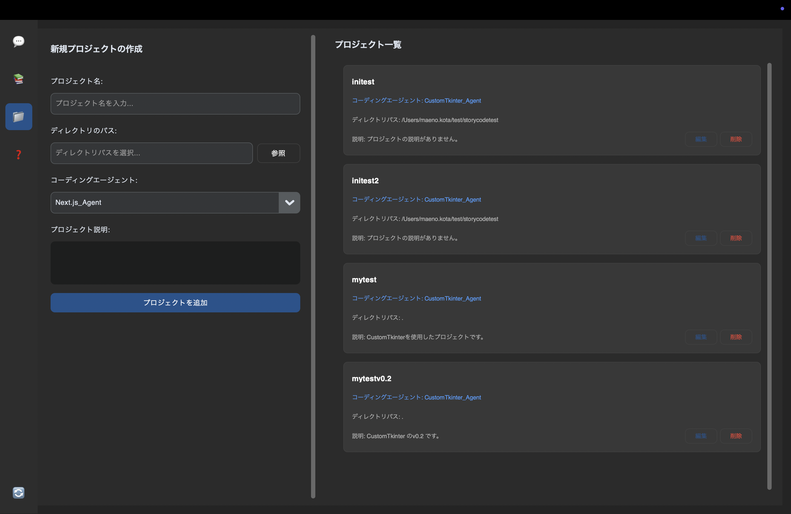
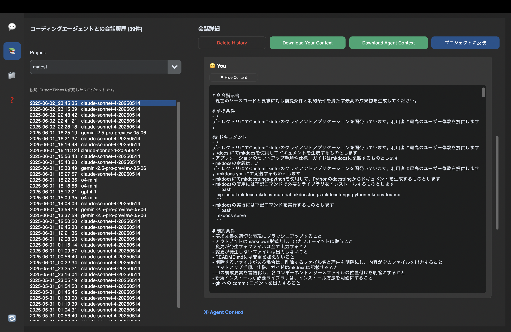

# チュートリアル
フロントエンドをNext.JSでバックエンドをFastAPIでフルスタックアプリを開発します

流れ

1. 初期セットアップ
# 準備
```bash
git init
```

```bash
npx create-next-app@latest frontend \
    --app \
    --ts \
    --tailwind \
    --eslint \
    --src-dir

cd frontend
# tailwindcssの最新化
npm install -D tailwindcss@latest @tailwindcss/postcss@latest
```
1. コード生成
1. 動作確認


## 1. プロジェクト登録


## 2.コード生成リクエスト


## 3.コーディングエージェントとの会話履歴


## その他.ヘルプ・ガイド
◊V